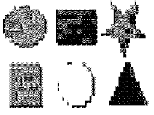
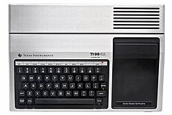
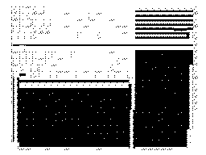

# Presenter99

Presenter99 is a slideshow engine written in BASIC for the [TI-99/4A](https://en.wikipedia.org/wiki/TI-99/4A).


## Usage

Slideshows are encoded in the engine program as `DATA` commands between lines 1-1899.
Simply edit [template.bas](src/template.bas) and run `make` to generate [presenter99.bas](src/presenter99.bas).
This program can be copied into an emulator such as Classic99.
Exporting to WAV files for cassette storage is planned.

### Format

A slideshow is encoded as a series of *events*.
Each event consists of an *opcode* and a list of arguments.

The first event is always `TITLE`, which sets the presentation's title, subtitle, and default foreground and background colors:

```basic
10 DATA "TITLE","My Presentation","Charles Averill",16,2
```

This data will be rendered as a title slide.

The remainder of the slideshow consists of slides, delimited by `SLIDE` events.
Each `SLIDE` event denotes a new slide with a given title:

```basic
20 DATA "SLIDE","Slide 1"
```

Within each slide can be any number of events.
A table of their effects is provided below.

| Event | Effect | Example |
|---|---|---|
| `TEXT` | Draw left-aligned text that may wrap around the screen | `30 DATA "TEXT","Here is some text"` |
| `LIST` | Draw an unordered list | `40 DATA "LIST","First","Second","Third","END"` |
| `SPACING` | Print `N` empty lines if `N>=0`, or print until the screen is almost full (for printing footers) if `N=-1` | `100 DATA "SPACING",-1` |
| `COLORS` | Update the foreground and background colors, will take effect on slide transition | `50 DATA "COLORS",5,16` |
| `PAUSE` | Pause in the middle of a slide | `95 DATA "PAUSE"` |
| `BIGIMG` | Denotes an image slide (see below) | `180 DATA "BIGIMG", 20, "TI-99/4A"` |

### Images

The `BIGIMG` token denotes two series of data:

1. A sequence of custom 8x8 character definitions to be passed into `CALL CHAR`
2. A run-length encoded (RLE) sequence of characters to fill the screen

Although possible, it's not recommended to generate these by hand.
[imgconverter.py](scripts/imgconverter.py) will take in an image file, a starting BASIC line, and a maximum number of characters, and generate a BASIC file with the encoded image.

Images are monochrome.
This could be adjusted, as characters occupy four groups of 8, so `CALL COLOR` could assign unique foreground and background colors to each image.
This would require some pretty hefty modification of the conversion script though.

Even with RLE, these images are very large.
The template barely fits two in.
Perhaps a future version will support loading from disks or cassettes.

| Original Image | Converted Image | Encoded Image |
| --- | --- | --- |
|  |  | [shapes.bas](media/shapes.bas) |
|  |  | [ti99.bas](media/ti99.bas) |
